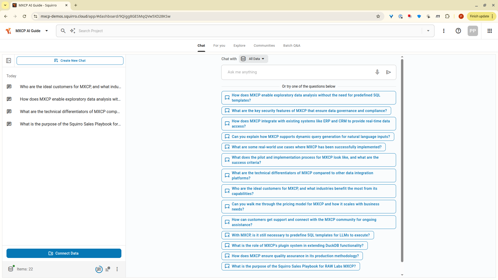

# Squirro Sales Documentation - RAW Labs MXCP Enterprise Data Platform

Welcome to the sales enablement documentation for RAW Labs MXCP - the enterprise data platform that powers Squirro's real-time data access capabilities.

## 📚 Available Documents

### 1. [Sales Enablement Guide](sales-enablement-guide.md)
**Comprehensive Sales Playbook** (20 sections)
- Complete guide for Squirro sales teams
- Covers positioning, qualification, demo scripts, and closing
- Includes technical scoping questions and pilot runbook
- ~15 minute read

### 2. [Sales One-Pager](sales-one-pager-mxcp.md) 
**Quick Reference Sheet** (8 sections)
- Concise overview for field use
- Key talking points and proof points
- Perfect for customer-facing discussions
- ~3 minute read

## 🎯 Key Capabilities

- **No SQL/Python knowledge required** - Business users query data using natural language
- **Three deployment approaches** - Automatic from dbt models, custom SQL tools, or Python integrations
- **Minimal infrastructure** - Runs on just 4GB RAM (vs 64GB+ for traditional platforms)
- **Bank-grade security** - Full RBAC, audit trails, and data masking capabilities
- **Real-time data access** - Connect to SAP, Salesforce, trading systems, and more

## 🚀 Quick Start

**New to MXCP?** Start with the [One-Pager](sales-one-pager-mxcp.md) for a quick overview.

**Preparing for a demo?** Jump to [Section 12: Demo Script](sales-enablement-guide.md#12-demo-script-3045-minutes) in the Sales Enablement Guide.

**Need pricing info?** See [Section 18: Packaging and Pricing](sales-enablement-guide.md#18-packaging-and-pricing-guidance) in the Sales Enablement Guide.

**Understanding capabilities?** Read [Section 4: Natural Language Data Access](sales-enablement-guide.md#4-natural-language-data-access---no-coding-required) for the complete picture.

## 🤖 MXCP AI Guide - Your Sales Assistant

Need quick answers about MXCP? Use our AI-powered guide:
- **Access**: https://mxcp-demos.squirro.cloud/ (Project: MXCP AI Guide)
- **What it knows**: Complete sales enablement guide + all MXCP technical documentation
- **Use cases**: 
  - Quick answers during customer calls
  - Technical clarifications for RFPs
  - Integration questions
  - Pricing and packaging guidance

## 🔗 Live Demo Environment

- **Squirro Chat**: https://mxcp-demos.squirro.cloud/ (Project: SwissBiz Demo)
- **MXCP Server**: https://ru9grd9gq8.eu-west-1.awsapprunner.com/mcp
- **Dataset**: SwissBiz - 1,000 Swiss companies with real-time search and analytics

## 📅 Last Updated

August 2025 - Major update incorporating Squirro Sales feedback

## 📧 Contact

- **Technical questions**: Pavlos (Implementation Lead) – pavlos@raw-labs.com
- **Pricing/commercial**: Miguel (CEO) – miguel@raw-labs.com
- **Integration support**: Ben (Tools & Integration Lead) – ben@raw-labs.com

---

*© 2025 RAW Labs. Confidential partner material.*
