# Squirro Sales Playbook: RAW Labs MXCP Enterprise Data Platform

**Partner**: Squirro  
**Document Type**: Sales Enablement Guide  
**Version**: 1.1  
**Date**: August 2025  
**Classification**: Partner Confidential

---

## 1. Purpose & Audience

This playbook equips Squirro sales teams and SEs to position, qualify, demo, and close deals that include RAW Labs MXCP for live data access. Use this guide to understand when MXCP adds value, how to demonstrate it, and how to handle technical/commercial discussions.

---

## 2. Executive Summary

**RAW Labs MXCP enhances Squirro's Enhanced RAG and Agent Framework with secure, real-time access to operational data.**

- **What**: Enterprise-grade MCP server connecting Squirro to ERP, CRM, trading platforms, and internal applications
- **Why**: Customers need AI that queries live business systems (not just documents), with sub-second freshness and audit trails
- **How**: MCP tools with stricting typing and validating, testing, RBAC policies, dynamic masking, audit trails and observability

---

## 3. The Evolution: From Data Virtualization to So Much More

You might have heard of RAW Labs as Squirro's "data virtualization" or "operational data pillar" - and yes, that's how we started. But here's the exciting part: **we're now SO much more.**

### What We've Become
- **MCP Pioneer**: First production-grade MCP server implementation (the "USB for AI" as everyone calls it)
- **Universal Connector**: Not just databases anymore - we connect SAP, Salesforce, ServiceNow, trading platforms, payment systems, internal applications
- **Natural Language Data Access**: Automatically executes SQL queries and Python logic from simple questions - no coding required
- **Performance Engine**: Built-in dbt and DuckDB for blazing-fast materialized views
- **Security Powerhouse**: Bank-grade authentication, authorization, and audit capabilities

### Why This Matters for Sales
When customers say "we need data virtualization," they're thinking small. Show them the bigger picture:
- It's not about connecting to databases - it's about AI that understands your entire business
- It's not about SQL queries - it's about natural language access to any system
- It's not about data movement - it's about governance, security, and real-time intelligence

---

## 4. Natural Language Data Access - No Coding Required

### The Game Changer: Dynamic Query Generation

MXCP enables business users to query data and invoke complex logic using natural language - **no pre-defined templates or coding needed**. This dramatically accelerates deployment and adoption.

**Flexible Implementation Options:**

**Option A: Automatic Tools from dbt Models**
- Deploy your dbt models → MXCP creates tools automatically
- Zero additional development required
- LLMs instantly understand your data model
- Perfect for teams already using dbt

**Option B: Dynamic Query Generation**
- LLMs generate queries on-the-fly from natural language
- No pre-configuration needed
- Ideal for exploratory analysis
- Business users self-serve immediately

**Option C: Custom-Built Tools**
- Developers create specific SQL or Python tools
- Implement complex business logic
- Ensure compliance and accuracy
- Optimize for performance

### Full Security Maintained

Even with dynamic SQL generation, MXCP enforces:
- User-based data access controls
- Row and column-level security
- Complete audit trails
- Automatic data masking

### Technology Foundation: SQL + Python Tools

MXCP provides two types of tools:

**SQL Tools (Out-of-the-box)**
- Query data stored in MXCP's high-performance layer (DuckDB/PostgreSQL)
- LLMs automatically generate SQL from natural language
- Perfect for analytics, reporting, and exploration
- No configuration needed - works immediately

**Python Tools (Custom logic)**
- Connect to any data source (APIs, databases, files)
- Handle complex transformations and calculations
- Integrate with ML models and external services
- Implement custom business rules

This means customers can:
- Start immediately with SQL against cached/ingested data
- Extend to any system using Python tools
- Combine both approaches in a single solution
- Scale from simple queries to complex integrations

Note: Snapi (our previous proprietary language) has been deprecated in favor of these industry standards.

**Bottom Line:** Customers can start querying and processing data immediately - no SQL or Python knowledge required.

---

## 5. Important Integration Notes

### Policy Enforcement & Security Features

**MXCP's Full Security Capabilities (Available Today in MXCP):**
- **User-Based Data Access**: Different users see different data based on their roles
- **Dynamic Data Filtering**: Automatic row-level and column-level security
- **Policy Enforcement**: Prevent certain data elements/records from being retrieved
- **Role-Based Exploration**: Customize which data areas different user roles can explore
- **Complete Audit Trail**: Every query is tracked with user identity and parameters
- **Data Masking**: PII and sensitive data automatically masked based on policies

**Integration Status with Squirro:**
These powerful features require Squirro to pass authenticated user tokens to MXCP. This integration is on the roadmap but not yet implemented.

**What This Means for Sales:**
- **Can Demo**: MXCP's security architecture, audit capabilities, and policy framework
- **Can Position**: How different users will see different data once integrated
- **Can Discuss**: Compliance benefits and governance capabilities
- **Cannot Demo Yet**: Live user-specific filtering through SquirroChat

**Key Selling Point:**
Even without full integration, MXCP supervises all operations, handles connectivity, and maintains security. The infrastructure is ready - it's just waiting for the Squirro integration to unlock per-user capabilities.

**Customer Message:** "MXCP has bank-grade security built in. As we complete the Squirro integration, you'll get automatic role-based data access without any changes to your MXCP setup."

### Demo Environment Available
A fully functional demo environment is available:
- **Squirro Chat**: https://mxcp-demos.squirro.cloud/ (Project: SwissBiz Demo)
- **MXCP AI Guide**: https://mxcp-demos.squirro.cloud/ (Project: MXCP AI Guide) - Your AI assistant for all MXCP questions
- **MXCP Server**: https://ru9grd9gq8.eu-west-1.awsapprunner.com/mcp
- **Dataset**: SwissBiz - 1,000 Swiss companies with search, aggregation, and time-series analysis capabilities

**💡 Pro Tip**: Use the MXCP AI Guide during demos to instantly answer technical questions. It knows our entire sales playbook and technical documentation!

---

## 6. Where RAW Labs Fits in the Squirro Stack

- **Enhanced RAG and Agents**: MXCP provides MCP tools that Squirro agents invoke for structured data tasks.
- **Data Access Layer**: Real‑time connections to SAP, Salesforce, trading systems, and internal applications; automatic tool generation from dbt models; Python tools for custom logic.
- **Governance**: OAuth2 via enterprise IdPs, RBAC, dynamic masking, row/column security, complete audit trails.

*Figure: How RAW Labs MXCP integrates with Squirro's Enhanced RAG and Agent Framework*

---

## 7. Case Studies

### Project Deployments
- **UAE Business Registry**: 50M+ business licenses accessible via natural language; Real‑time access to business licenses; POC built in one afternoon; supports queries like recent licenses, owner nationalities, emirate breakdowns.
- **Vodafone UK**: Network planning across 7 data sources; Unified 7 Excel/CSV sources for site selection/capacity planning; 92.9% weighted accuracy; <4s responses; 16‑week POC success.

### Exciting Opportunities
- **C-RAF Compliance**: Working with banks to meet HKMA's Cyber Resilience Assessment Framework; enables natural language queries like "Which banks need help with baseline cyber maturity?" or "Show compliance gaps across institutions"; represents a generic compliance use case applicable globally.

### Emerging Use Case: Data Quality & ETL Resilience
- **Problem**: Companies aggregating broker logs for compliance face frequent ETL breakdowns due to schema errors in CSV files
- **Traditional Approach**: Rigid ETL pipelines that fail on any schema variation
- **MXCP Solution**:
  - Intelligent schema inference handles variations automatically
  - LLMs can assist in data cleaning and normalization
  - Real-time data quality monitoring and alerting
  - Graceful handling of malformed data without pipeline failure
- **Business Impact**: 
  - Eliminate client dissatisfaction from missing data
  - Reduce engineering time spent fixing ETL issues
  - Enable compliance checks even with imperfect data
  - Create audit trails of data quality issues
- **Key Message**: "MXCP doesn't just query clean data - it helps you handle messy, real-world data streams"

This represents a massive opportunity in financial services, logistics, and any industry dealing with multi-source data aggregation.

### Demo Deployments
- **SwissBiz Demo**: A demonstration using public Swiss business data; 1,000+ companies with real-time search and analytics.

_All these deployments are integrated with Squirro Chat._

### What You Can Tell Your Prospects
- **Production-ready**: Multiple live deployments, not just demos
- **Diverse use cases**: From government registries to telco analytics to compliance reporting
- **Proven scale**: Handling millions of records in production
- **Global reach**: Deployments across different regions and industries

### Active MXCP Servers for Squirro

*Figure: Current MXCP deployments maintained by RAW Labs for Squirro.*

---

## 8. The Hybrid Approach: Real-Time + Cached Data

MXCP uniquely combines both real-time virtualization AND optimized data ingestion in a single platform:

### 8.1 Real-Time Data Access
- Query live data directly at the source
- No data duplication or movement
- Perfect for sensitive data that must stay in place
- Ideal when you need the absolute latest information

### 8.2 Performance Layer (dbt/DuckDB)
- Ingest and optimize frequently accessed data
- Use dbt to transform and model data
- Cache in high-performance DuckDB
- Reduce load on production systems

### 8.3 Best of Both Worlds
Most production deployments use BOTH approaches:
- **Hot paths**: Frequently queried data cached in DuckDB for <1s responses over very large datasets
- **Long tail**: Less common queries go directly to source systems
- **Sensitive data**: Stays in original systems, accessed only when needed
- **Single interface**: Users don't need to know which approach is used

This hybrid architecture ensures optimal performance while maintaining data governance and freshness requirements.

---

## 9. Ideal Customer Profile (ICP) - MXCP

### Strong Indicators for MXCP
- ✓ Needs AI to query operational systems (SAP, Salesforce, Oracle ERP, trading platforms)
- ✓ Requires sub-minute data freshness for decision-making
- ✓ Strict data governance/compliance requirements (banking, healthcare, government)
- ✓ Cannot duplicate sensitive data outside source systems

## 10. Technical Scoping Questions

### 10.1 Data Sources & Volume (for Logic Pack sizing)
- "How many distinct data sources need to be connected?"
- "What's the total data volume per source (to determine tier: entry/mid-range/enterprise)?"
- "Are these standard connectors or custom integrations?"
- "Do you need both read and write capabilities, or read-only access?"

### 10.2 Data Architecture
- "What types of data sources do you need to connect (databases, APIs, files, data warehouses, SaaS applications)?"
- "For databases: Which systems and versions (Oracle, SQL Server, PostgreSQL, MongoDB, etc.)?"
- "For APIs: REST, GraphQL, SOAP? Do you have API documentation?"
- "For files: What formats (CSV, JSON, XML, Parquet)? Where are they stored (S3, Azure Blob, network drives)?"
- "For enterprise systems: Which platforms (SAP, Salesforce, ServiceNow, custom applications)?"
- "Are you currently using dbt? Do you have existing dbt models we can leverage for instant tool generation?"
- "What are the key relationships between these different data sources?"

### 10.3 Performance & Freshness
- "What's the acceptable data latency (real-time, seconds, minutes, hourly)?"
- "Expected query volume and concurrent users?"
- "Are there specific peak usage patterns?"
- "Which queries need optimization via dbt materializations?"

### 10.4 Security & Access Control
- "How do users authenticate today (SSO provider, MFA requirements)?"
- "Should we mirror source system permissions?"
- "Any specific data masking requirements (PII, financial data)?"
- "Compliance frameworks to follow (ISO 27001, SOC 2, industry-specific)?"

### 10.5 Integration Requirements
- "How should we connect to your systems (direct connection, VPN, API gateway, cloud storage)?"
- "Any firewall rules, IP whitelisting, or network restrictions?"
- "For cloud services: Which regions? Any data residency requirements?"
- "Do you need real-time streaming, batch processing, or both?"
- "Export/integration needs (Excel, BI tools, downstream APIs)?"

---

## 11. The Sales Conversation (Talk Track)

Opening: 
> "Squirro Chat is great on documents. With RAW Labs, it also works with your SAP, Salesforce, trading platforms—securely and with full audit."

Position by audience:
- **Business**: "Real‑time answers from your ERP and CRM, not yesterday's export."
- **IT/Security**: "Data stays in‑custody. OAuth2/RBAC, masking, full audit."
- **Data teams**: "Connect any system; SQL and Python; optional dbt for performance."

Common objections and responses:
- "We already have Squirro Chat" → "Great—this adds live systems without migration."
- "Security/compliance risk" → "Every access is authenticated, authorized, audited; masking and row/column controls."
- "Sounds complex" → "POC in one afternoon for UAE; Vodafone in days, not months."

---

## 12. Demo Script (30–45 minutes)

### Demo Flow Overview

```mermaid
flowchart TD
    Start{{"<b>START DEMO</b><br/>⏱️ 5 minutes"}}
    
    Opening["<div style='text-align: left; padding: 10px;'><b>1. OPENING</b><br/>━━━━━━━━━━━━━━━━━━━━━<br/>• Show SquirroChat with documents<br/>• <i>'What about live operational data?'</i></div>"]
    
    Search["<div style='text-align: left; padding: 10px;'><b>2. LIVE DATA SEARCH</b> ⏱️ 10 min<br/>━━━━━━━━━━━━━━━━━━━━━<br/><b>Tool: search_companies</b><br/>• <i>'Companies in Zürich last 30 days'</i><br/>• Natural language → structured query<br/>• Sub-3 second response</div>"]
    
    Analytics["<div style='text-align: left; padding: 10px;'><b>3. COMPLEX ANALYTICS</b> ⏱️ 10 min<br/>━━━━━━━━━━━━━━━━━━━━━<br/><b>Tool: aggregate_companies</b><br/>• <i>'Average capital by legal form'</i><br/>• Real-time aggregation<br/>• No pre-processing needed</div>"]
    
    TimeSeries["<div style='text-align: left; padding: 10px;'><b>4. TIME-SERIES ANALYSIS</b> ⏱️ 10 min<br/>━━━━━━━━━━━━━━━━━━━━━<br/><b>Tool: timeseries_companies</b><br/>• <i>'Registration trends by year'</i><br/>• Spot market patterns<br/>• Business insights</div>"]
    
    Discovery["<div style='text-align: left; padding: 10px;'><b>5. DATA DISCOVERY</b> ⏱️ 5 min<br/>━━━━━━━━━━━━━━━━━━━━━<br/><b>Tool: categorical_company_values</b><br/>• <i>'What legal forms exist?'</i><br/>• Dynamic value discovery</div>"]
    
    Close["<div style='text-align: left; padding: 10px;'><b>6. CLOSE</b> ⏱️ 5 min<br/>━━━━━━━━━━━━━━━━━━━━━<br/>• <i>'Works with SAP, Salesforce, etc.'</i><br/>• <i>'Deployed on AWS in hours'</i><br/>• Reference: UAE, Vodafone</div>"]
    
    Start --> Opening
    Opening --> Search
    Search --> Analytics
    Analytics --> TimeSeries
    TimeSeries --> Discovery
    Discovery --> Close
    
    classDef startClass fill:#9b7ec7,stroke:#7a5ba6,stroke-width:3px,color:#fff
    classDef openingClass fill:#6fa3d2,stroke:#4a82b3,stroke-width:3px,color:#fff
    classDef searchClass fill:#4ebdb9,stroke:#2d9a96,stroke-width:3px,color:#fff
    classDef analyticsClass fill:#43e97b,stroke:#2eb85c,stroke-width:3px,color:#fff
    classDef timeClass fill:#38f9d7,stroke:#1fc9a8,stroke-width:3px,color:#333
    classDef discoveryClass fill:#f5b97f,stroke:#e89a4f,stroke-width:3px,color:#fff
    classDef closeClass fill:#ffd166,stroke:#e6b347,stroke-width:3px,color:#333
    
    class Start startClass
    class Opening openingClass
    class Search searchClass
    class Analytics analyticsClass
    class TimeSeries timeClass
    class Discovery discoveryClass
    class Close closeClass
```

### Demo Architecture

```mermaid
flowchart LR
    User["👤 Sales Rep<br/><i>Dashboard & Insights</i>"]
    SC["<b>SquirroChat</b><br/>mxcp-demos.squirro.cloud<br/><i>Natural Language Processing</i>"]
    RAG["<b>Enhanced RAG +<br/>Agent Framework</b><br/><i>Intelligent Query Routing</i>"]
    MXCP["<b>MXCP Server</b><br/>AWS App Runner<br/><i>ru9grd9gq8.eu-west-1.awsapprunner.com/mcp</i>"]
    Tools{{"<b>MCP Tools</b><br/><i>API Gateway</i>"}}
    T1["<b>search_companies</b><br/><i>Find specific companies</i>"]
    T2["<b>aggregate_companies</b><br/><i>Analytics & grouping</i>"]
    T3["<b>timeseries_companies</b><br/><i>Trend analysis</i>"]
    T4["<b>categorical_company_values</b><br/><i>Data discovery</i>"]
    DB[("<b>🗄️ DuckDB</b><br/>SwissBiz Dataset<br/>1,000 companies, 30 years")]
    DBT["<b>dbt model:</b><br/>swiss_companies<br/><i>Transformations</i>"]
    
    User --> SC
    SC --> RAG
    RAG --> MXCP
    MXCP --> Tools
    Tools --> T1
    Tools --> T2
    Tools --> T3
    Tools --> T4
    T1 --> DB
    T2 --> DB
    T3 --> DB
    T4 --> DB
    DB --> DBT
    
    classDef userClass fill:#9b7ec7,stroke:#7a5ba6,stroke-width:3px,color:#fff
    classDef squirroClass fill:#6fa3d2,stroke:#4a82b3,stroke-width:3px,color:#fff
    classDef ragClass fill:#4ebdb9,stroke:#2d9a96,stroke-width:3px,color:#fff
    classDef mxcpClass fill:#43e97b,stroke:#2eb85c,stroke-width:3px,color:#fff
    classDef toolsClass fill:#38f9d7,stroke:#1fc9a8,stroke-width:3px,color:#333
    classDef toolClass fill:#e3ffe7,stroke:#43e97b,stroke-width:2px,color:#2a6b2a
    classDef dbClass fill:#f5b97f,stroke:#e89a4f,stroke-width:3px,color:#fff
    classDef dbtClass fill:#ffd166,stroke:#e6b347,stroke-width:3px,color:#333
    
    class User userClass
    class SC squirroClass
    class RAG ragClass
    class MXCP mxcpClass
    class Tools toolsClass
    class T1,T2,T3,T4 toolClass
    class DB dbClass
    class DBT dbtClass
```

### 12.1 Setup Requirements
- **Live Demo Environment**: https://mxcp-demos.squirro.cloud/
- **MXCP Server**: https://ru9grd9gq8.eu-west-1.awsapprunner.com/mcp
- **Dataset**: SwissBiz - 1,000 Swiss company registrations (30 years of data)
- **Pre-configured MXCP tools**: search_companies, aggregate_companies, timeseries_companies, categorical_company_values

**🎯 Demo Strategy**: Keep the MXCP AI Guide open in another tab. If prospects ask technical questions beyond the demo script, switch to the AI Guide and ask it directly. This shows:
1. How Squirro can create intelligent assistants from any knowledge base
2. Real-time problem solving without memorizing every detail
3. The power of combining documents (sales guide) with structured data (SwissBiz)

### 12.2 Demo Flow

#### 1. Opening (5 min)
- Show standard SquirroChat working with documents
- Ask: "What happens when you need real-time operational data from SAP, Salesforce, or your business registry?"

#### 2. Live Data Search (10 min)
**Prompt**: "Show me all companies registered in Zürich in the last 30 days"
- **Tool used**: `search_companies` with canton and date filters
- **Point out**: Natural language converted to structured query
- **Show**: Sub-3 second response from 1,000+ records
- **Try variations**: "Find GmbH companies with over 1 million CHF capital"

#### 3. Complex Analytics (10 min)
**Prompt**: "What's the average share capital by legal form and canton?"
- **Tool used**: `aggregate_companies` with group_by parameter
- **Show**: Instant aggregation across entire dataset
- **Follow up**: "Show me industry distribution for financial services (code 64)"
- **Highlight**: No pre-aggregation needed - real-time analysis

#### 4. Time-Series Analysis (10 min)
**Prompt**: "Show company registration trends by year for the last decade"
- **Tool used**: `timeseries_companies` with yearly interval
- **Demonstrate**: "Break this down by canton" or "Show only AG companies"
- **Business value**: Spot market trends, economic patterns

#### 5. Data Discovery (5 min)
**Prompt**: "What legal forms are available in the registry?"
- **Tool used**: `categorical_company_values` 
- **Show**: Dynamic discovery of data values
- **Try**: "What industries are represented?" 

#### 6. Close (5 min)
- "This same setup works with your SAP, Salesforce, trading systems"
- "Deployed on AWS in hours, not months"
- Reference: UAE (one afternoon), Vodafone (days not months)

### Example Queries for Demo

These queries work with the live demo environment:

**Search Examples:**
- "Find all AG companies in Zürich"
- "Show companies with more than 500 employees"
- "Which companies were registered in the last 90 days?"
- "Find financial services companies (industry code 64) with capital over 500,000 CHF"

**Analytics Examples:**
- "What's the total capital by canton?"
- "Show average number of employees by legal form"
- "Group companies by industry and show total capital"

**Time-Series Examples:**
- "Show monthly registration trends for 2024"
- "How many companies were registered each year in the last decade?"
- "Show yearly trend of AG vs GmbH registrations"

**Discovery Examples:**
- "What cantons are in the database?"
- "List all available industry codes"
- "What legal forms exist in Switzerland?"

### Demo Video

---

## 13. Recommended CTAs for Reps (Internal)

Choose the CTA that best fits your customer's situation:

- **Technical Demo**: Show live data queries with their systems
- **Pilot Program**: Start with 1-2 data sources to prove value
- **Security Review**: Deep dive on compliance and controls
- **Quick Add-on**: For existing SquirroChat users

Key points to emphasize:
- Real-time access to operational data
- Security and audit capabilities
- No data migration required
- Fast implementation

---

## 14. Pilot Runbook

### 14.1 Steps
1. **Discovery**: Identify 1–2 high‑value tables/APIs; define success metrics
2. **Setup**: Stand up MXCP; connect to source systems
3. **Configuration**: Define 2–3 tools with typed inputs/outputs
4. **Optimization** (Optional): dbt materializations for frequently accessed data
5. **Policy Setup**: Configure role-based access and masking rules
6. **Integration Testing**: Demo flows in SquirroChat
7. **Validation**: Verify performance, accuracy, and security controls
8. **Audit Review**: Export audit trails and verify compliance
9. **Stakeholder Review**: Executive demo and go/no‑go decision

### 14.2 Success Criteria
- **Performance**: Low latency responses (target <4s)
- **Accuracy**: High response correctness with proper data filtering
- **Security**: Audit trail present for every query
- **Governance**: Role-based masking and access controls working as configured

---

## 15. Security & Compliance (Facts to Use with IT)

- **Authentication**: OAuth 2.0 with enterprise IdPs (Azure AD, GitHub, Atlassian); API keys for services.
- **Authorization**: RBAC with policy enforcement.
- **Data protection**: Dynamic masking; row/column security through policies.
- **Audit**: Complete tracking for compliance; tracks identity, params, sources, policies.

### Forward Looking: Governance & Evidence
* RAW Labs is actively extending MXCP with **cryptographic audit evidence and OpenTelemetry-native observability**.
* Roadmap includes **auditor-accepted evidence bundles, policy enforcement via OTel Collector**, and **industry templates (Basel III, EU AI Act, GDPR)**.
* **Target**: Financial services first, with pilots running in late 2025.
* **Value**: “Trust you can prove” — not just logs, but compliance-grade evidence.

---

## 16. Deployment Patterns (Aligns with Squirro)

- **On‑Prem**: RHEL/Rocky; VM or standard install.
- **Containers**: Docker Compose; Helm/Kubernetes supported.
- **Cloud**: AWS/GCP/Azure/Hetzner; single‑tenant isolation.

*Figure: Flexible deployment patterns aligned with Squirro's infrastructure options*

---

## 17. Infrastructure Requirements (Simplified)

**MXCP is remarkably lightweight** - it runs on a laptop for development or a modest server for production.

**Key Requirements:**
- **Memory**: 2-4GB RAM (compare to 64GB+ for traditional data platforms)
- **Storage**: 1GB base + space for your data
- **Network**: Standard HTTPS connectivity

**Deployment Options:**
- Cloud (AWS, Azure, GCP) - deploys in minutes
- On-premise - any Linux server
- Containers - Docker/Kubernetes ready
- Can co-locate with Squirro or run separately

**Customer Benefit:** Start small, scale as needed. No massive infrastructure investment required.

**For technical details:** https://mxcp.dev/docs/guides/operational#system-requirements

---

## 18. Packaging and Pricing Guidance

### 18.1 Core Concept: Logic Pack
- **Logic Pack** = 1 data source + 10GB + 1 API/Dataset
- Base package includes 1 logic pack
- Additional logic packs can be added (must be pre-scoped)

### 18.2 Packaging Structure
- **Base Package**: 1 Logic Pack (source + 10GB + API/Dataset)
- **Data Volume Tiers**: 
  - Tier 1: Entry level
  - Tier 2: Mid-range  
  - Tier 3: Enterprise scale
- **Data Source Types**:
  - Standard Data Sources (pre-built connectors)
  - Custom Data Sources (bespoke integrations)
- **Add-ons**: Enterprise Security (SSO), Additional Logic Packs

### 18.3 Commercial Terms
- Annual support mandatory (percentage of license cost)
- Minimum contract period applies
- Cloud costs billed monthly if RAW-managed deployment
- All add-ons priced as monthly cost increases

---

## 19. Internal Escalation (RAW Labs)

- **Technical questions**: Pavlos (Implementation Lead) – pavlos@raw-labs.com
- **Pricing/commercial**: Miguel (CEO) – miguel@raw-labs.com
- **Integration support**: Ben (Tools & Integration Lead) – ben@raw-labs.com

---

## 20. Resources

- **RAW Labs**: [www.raw-labs.com](https://www.raw-labs.com/)
- **MXCP**: [mxcp.dev](https://mxcp.dev)
- **MXCP White Paper**: [MXCP: The Production-Grade MCP Server and Methodology for Enterprise AI](https://raw-labs.com/blog/mxcp-production-mcp-enterprise-ai)
- **MXCP AI Guide**: Your 24/7 sales assistant at https://mxcp-demos.squirro.cloud/ (Project: MXCP AI Guide)

---

*© 2025 RAW Labs. Confidential partner material.*
