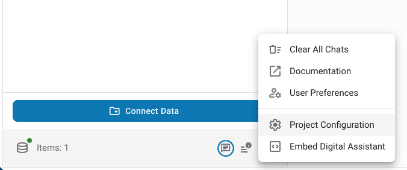
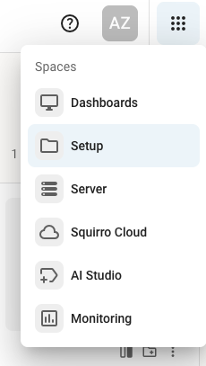

# Swiss Biz Setup Guide

## 1. Add MXCP Server

The Swiss Biz demo connects to an MXCP server that provides access to synthesized structured data.

**Steps:**
1. Go to **Project Configuration** (bottom left)
   
2. Navigate to **Agents** → Select your agent (default: "All Data")
3. Click **"Configure new tool"** → Select **"MCP Server Tools"**
4. Configure the tool:
   - **Tool display name**: Swiss Biz Data MCP
   - **Tool name**: Swiss Biz Data
   - **Tool description**: A synthetic Swiss business registry dataset containing 1,000 realistic companies with proper legal forms (AG, GmbH, Einzelfirma), valid Swiss cantons, NACE industry classifications, share capital compliant with Swiss legal requirements, employee counts, and registration dates spanning from December 1995 to October 2025 with an exponential distribution favoring more recent registrations to simulate natural business growth patterns.
   - **Server URL**: `https://ru9grd9gq8.eu-west-1.awsapprunner.com/mcp`

5. **Customize the persona** (left side):
   - Add preferences like: *"You are a business analyst. When you show flat (not nested) data, show it in tabular format."*
   - **Why?** This makes responses appear as if written by a business analyst and formats results as tables instead of bullet points.
   - **Tip:** Feel free to experiment with different persona text depending on how you want the demo to behave.

6. **Save changes**

## 2. Set Up Chart Plotting (Optional)

Enable visual data representation through charts.

**Steps:**
1. Go to **Project Configuration** → **Agents** → Select your agent
2. Click **"Configure new tool"** → Select **"Line Chart Plotter"**
3. Set the **name** and use this **description** (this tells the LLM how and when to use the chart tool):

```
Tool to PLOT CHARTS. ALWAYS use this tool to answer requests related to charts.

It accepts the following parameters: `title`, `categories`, `data`; where `categories` is the array of categories displayed on the x-axis, while `data` is a highcharts series with name of the product/metric and value for the range of categories.

Data MUST ALWAYS BE an array of objects:

[
    {
        "name": "Product 1",
        "data": [10.3323, 10.0447, 10.4904, 10.277, 10.9482, 10.7114, 11.0562, 10.8909, 10.3896, 10.4462, 10.0684, 10.5141]
    }
]

If plotting time series data, ensure the x-axis is sorted chronologically and the y-axis data matches the correct dates.

Once you receive the output from this tool, you MUST paste the output in the RESPONSE to the user at the position where you'd like the chart to appear.
```

## 3. Add Prompt Templates

The prompt library feature allows you to create reusable prompt templates.


**Note:** The current Swiss Biz instance has a column on the right with example prompts (created before the prompt library feature existed). You can now add prompts to the library instead for better reusability across projects.

Navigate to the prompt library and add your custom prompts for easy reuse.

**Example prompts to add:**
1. Show me all companies registered in Zürich in the last 30 days
2. Show company registration trends by year for the last decade
3. Show the total capital by year on a line chart
4. What's the average share capital by legal form and canton?
5. What legal forms are available in the registry?

## 4. Configure the Model

**Important**: Use **gpt-4.1** instead of the default gpt-4o. The default gpt-4o is about 2 years old and has poor performance. **gpt-4.1 is much better.**

**Steps:**
1. Go to **Setup** (see icon below)
   
2. Navigate to **Settings** → **Project Configuration**
3. Find `genai.sqgpt.settings` → Click **Edit**
4. Replace `gpt-4o` with `gpt-4.1`
5. **Save changes**

**Why gpt-4.1?** It's the best "one-shot" model (no internal thinking process), providing faster responses with lower token usage. "Thinking" models are more powerful but significantly slower and more expensive.

---

**You're all set!** 🎉 